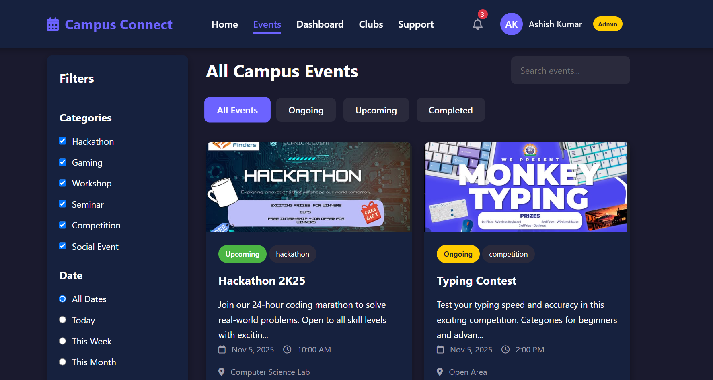

# Campus Connect 🎓

Campus Connect is a **campus event aggregator web application** built using **HTML, CSS, and JavaScript**.  
It provides students with a centralized platform to discover, explore, and participate in campus events — including cultural fests, technical workshops, seminars, and more.

---

## 🌐 Live Preview
> 🔗 **Preview Link:** [Add your website link here]()

*(You can insert a deployed link or local server URL once hosted.)*

---

## 📋 Table of Contents
- [Introduction](#introduction)
- [Features](#features)
- [Technologies Used](#technologies-used)
- [Installation](#installation)
- [Usage](#usage)
- [File Structure](#file-structure)
- [Screenshots](#screenshots)
- [Troubleshooting](#troubleshooting)
- [Contributors](#contributors)
- [License](#license)

---

## 🧩 Introduction
Campus Connect simplifies how students stay informed about what’s happening around campus.  
Instead of searching across multiple sources, users can view all events in one place — sorted by category, date, and club type.

---

## ✨ Features
- 📅 Aggregates campus-wide events in one dashboard  
- 🔍 Filter events by club, category, or type  
- 🖼️ Responsive design suitable for mobile and desktop  
- ⚡ Fast and lightweight — built purely with HTML, CSS, and JS  
- 🧭 Simple and intuitive user interface  

---

## 🛠️ Technologies Used
| Technology | Purpose |
|-------------|----------|
| **HTML5** | Structure and layout |
| **CSS3** | Styling and responsiveness |
| **JavaScript (Vanilla JS)** | Event handling and interactivity |

---

## ⚙️ Installation
To set up the project locally:

```bash
# Clone this repository
git clone https://github.com/your-username/campus-connect.git

# Navigate into the project directory
cd campus-connect

# Open in browser
start index.html
```
*(or simply double-click `index.html` to open it in your browser)*

---

## 🚀 Usage
1. Launch the `index.html` file in your web browser.  
2. Browse through different clubs and upcoming events.  
3. Click on an event to view more details.  

---

## 📂 File Structure
```
Campus Connect/
│
├── index.html          # Main landing page
├── style.css           # Styling for the web app
├── script.js           # Core interactivity logic
└── images/             # Logos, screenshots, and media assets
```

---

## 🖼️ Screenshots
Below are some example placeholders for adding screenshots and previews of your website:

| Home Page | Events Page |
|------------|-------------|
|  |  |

> 💡 *Replace the image paths above with actual screenshots or add a link to your hosted demo.*

---

## 🧰 Troubleshooting
If something doesn’t display correctly:
- Ensure all file paths (especially for images) are correct.  
- Try clearing your browser cache.  
- Check that JavaScript is enabled in your browser.  

---

## 👨‍💻 Contributors:
Akshayverma001
129Ashish

- **Team Campus Connect**  
  *Developed as part of Hackathon 2K25 project.*


⭐ **Campus Connect** — Making campus life more connected, one event at a time!
